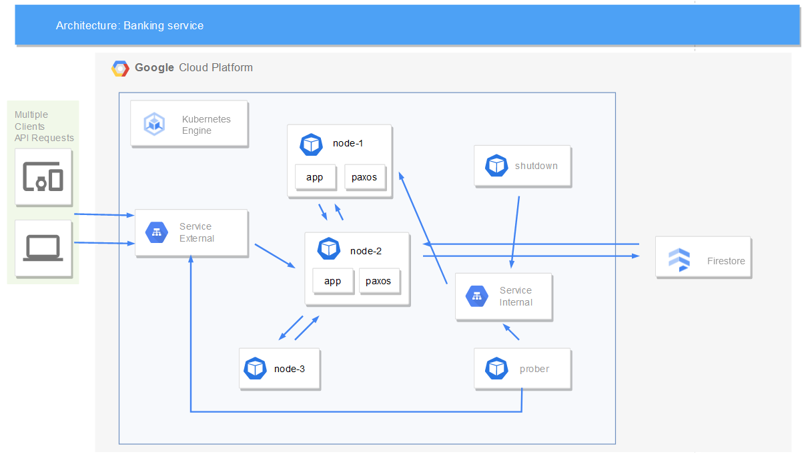

# Banking system


## TL;DR
We created high-available service banking for transactions.
## Used technologies 

As our main tool we chose Kubernetes - popular open-source platform for automating the deployment, scaling, and management of containerized applications. It is particularly well-suited for our highly available service because it provides a number of features that can help ensure the availability of it.

First, Kubernetes offers automatic self-healing capabilities. If a containerized application fails or becomes unavailable, Kubernetes can automatically restart it or replace it with a new instance. This can help reduce downtime and ensure that the service is always available.

Second, Kubernetes allows the application to easily scale the application up or down based on demand. This can help prevent the service from becoming overloaded or unavailable due to increased demand.

Finally, Kubernetes provides a number of features for networking and load balancing, such as service discovery and DNS-based service discovery. This can help ensure that traffic is distributed evenly across all of the instances of the application, further improving its availability.

For a database, we chose Firestore, a cloud-based NoSQL document database provided by GCP. It is designed to handle very large volumes of data and high levels of read and write throughput, and it automatically scales up or down based on your application's needs, so we didn't have to worry about capacity planning. Additionally, Firestore has a robust transactions system and supports optimistic locking, which allows multiple clients to make conflicting changes to the same data without causing errors. As a part of the Google Cloud platform, Firestore also integrates well with other Google Cloud services.
We chose to write our services in Python because of its straightforward syntax and ease of use. This made it a good choice for prototyping and developing our applications quickly. Additionally, Python has a large, active community of developers who contribute to the language and its ecosystem of libraries and frameworks. This means there is a wealth of explanations of concepts and tutorials we could use while working on a project. For web development, we used the Flask and Quart web frameworks, which are lightweight and easy-to-use frameworks that are well-suited for building web services. Their simplicity and flexibility made it a good choice for our needs.

We used the well-established HTTP protocol for communication between our microservices because it is supported by virtually all web servers and clients. This made it a natural choice, especially since all of the technologies we are using also support HTTP. Using HTTP allowed us to take advantage of its wide range of features and its compatibility with a variety of different systems.

## System architecture


[TODO] update obrazka i opisu poniżej

In our system, clients communicate with the service by accessing the Kubernetes load balancer and its external IP.

If running with leader, the load balancer is configured to forward traffic to the elected leader node, while the other containers serve only as Paxos nodes. When a request is received, the leader container (shown in blue in the above diagram) sends the appropriate request to the Firestore database and then responds to the client. The excellent transaction system in Firestore allows it to handle multiple parallel requests effectively.

Otherwise the load balancer forwards traffic to every node. 

A prober microservice is scheduled to periodically check the service's functionality by updating its own banking account by 1. If the request fails, it initiates a new leader election process and updates the load balancer to forward traffic to the new leader.

To access the services, the containers use a key generated for the GCP service account with access to the database. The key is stored as a secret in Kubernetes and is mounted when the pod is started. In our solution, we also used a Kubernetes service account to give the prober pod access to change the load balancer target.

## Functionalities
The banking node pods provide a number of endpoints to serve banking transactions:

Endpoint: GET /

Description: Serves a simple webpage showing all accounts and their balances.

Endpoint: POST /open_account

Description: Creates a new account.

Request Parameters: None

Response:

account_id: The ID of the created account.
Example Response:
{
"account_id": <uuid>
}

Endpoint: POST /deposit_money

Description: Deposits money to the account.

Request Parameters:

account_id: The ID of the account to deposit money to (required).
amount: The amount of money to add (required).
Example Request:
{
"account_id": <uuid>,
"amount" : <int>
}

Endpoint: POST /withdraw_money

Description: Withdraws money from the account.

Request Parameters:

account_id: The ID of the account to withdraw money from (required).
amount: The amount of money to withdraw (required).
Example Request:
{
"account_id": <uuid>,
"amount" : <int>
}

Endpoint: POST /move_money

Description: Moves money between the accounts.

Request Parameters:

source.account_id: The ID of the account to transfer money from (required).
destination.account_id: The ID of the account to transfer money to (required).
amount: The amount of money to transfer (required).
Example Request:
{
"source": { "account_id" : <uuid> },
"destination": { "account_id" : <uuid> },
"amount" : <int>
}

Endpoint: GET /check_account

Description: Checks the balance of an account.

Request Parameters:

account_id: The ID of the account to check (required).
Example Request:
{
"account_id": <uuid>
}

Response:

balance: The balance of the account.
Example Response:
{
"balance": <int>
}

Endpoint: POST /shutdown

Description: Shuts down the banking node.

Response: "Server shut down..."

## Catalog structure and files description
- images/architecture.png - image of the architecture
- k8s-apply - Kubernetes definitions (created from k8s/, */deployment.tmpl)
- node/app - banking operations and user frontend
- node/paxos - Paxos for coordination
- prober - prober microservice
- shutdown - shutdown microservice
- stress-test - testing for performance
- build.yaml - containers GCP build description
- infra-*.sh - deployment scripts
- README.md - this document

## Deployment
### Prerequisites
gcloud
kubectl
python (venv, pip)

### Steps
```bash
gcloud auth login 
./infra-init.sh <OPTIONAL project_id>
./infra-build.sh
./infra-run.sh
```

### Teardown
```bash
gcloud container clusters delete banking-cluster --region europe-central2
gcloud artifacts repositories delete banking-repo --project=<PROJECT_ID> --location europe-central2
```
Manually delete firestore "account" collections.


## Testing and performance
[TODO]


